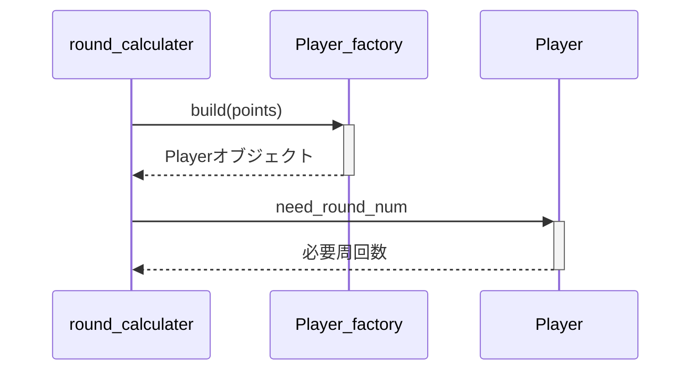
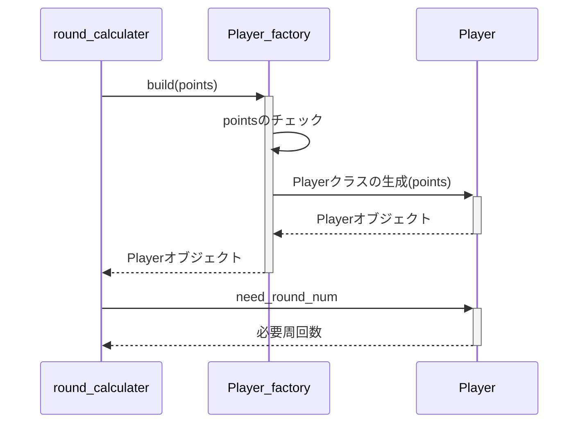

# シーケンス図

## 基本的な処理

round_calculater.rbから見える処理

```mermaid
sequenceDiagram
	participant main as round_calculater
	participant Player_factory
	participant Player

	main ->> + Player_factory: build(points)
	Player_factory -->> - main: Playerオブジェクト

	main ->> + Player: need_round_num
	Player -->> - main: 必要周回数
```

全ての処理

```mermaid
sequenceDiagram
	participant main as round_calculater
	participant Player_factory
	participant Player

	main ->> + Player_factory: build(points)
	Player_factory ->> Player_factory: pointsのチェック
	Player_factory ->> + Player: Playerクラスの生成(points)
	Player -->> - Player_factory: Playerオブジェクト
	Player_factory -->> - main: Playerオブジェクト

	main ->> + Player: need_round_num
	Player -->> - main: 必要周回数
```

## 一日で回復するスタミナを得る

```mermaid
sequenceFiagram

```